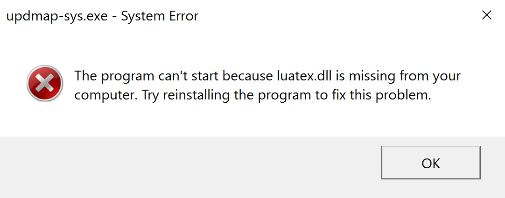

Radiant is a platform-independent browser-based interface for business analytics in [R](https://www.r-project.org/), based on the [Shiny](https://www.rstudio.com/shiny/) package. Developed by <a href="http://rady.ucsd.edu/faculty/directory/nijs/" target="_blank">Vincent Nijs</a>. Please use the issue tracker on GitHub to suggest enhancements or report problems: <a href="https://github.com/radiant-rstats/radiant/issues" _target="_blank">https://github.com/radiant-rstats/radiant/issues</a>. For other questions and comments please use radiant@rady.ucsd.edu.

> **Note:** R 3.4 or higher is now required to use the latest version of Radiant.

> **Note:** User profiles (or user names or logins) containing non-ASCII characters may cause problems during installation. To address this issue please use a profile name (login) that contains ASCII (A-Z, a-z) letters and numbers only. For example, c:\\users\\myprofilename

## Installing Radiant on Windows

For Windows, download and run the all-in-one installer for <a href="https://www.dropbox.com/s/23b9qblouc2eydm/Rady-Radiant-Installer-R3.4.4.exe?dl=1" target="_blank">R, Rstudio, and Radiant</a>. For a video tutorial see the `Install Radiant on Windows` video below:

<iframe width="640" height="375" src="https://www.youtube.com/embed/iaB4mTrm2Co" frameborder="0" allowfullscreen></iframe>

> Note: You may see the two messages below pop-up when installing `TinyTex`. This is expected and nothing to worry about. Just click "OK" and let the install process continue. 

<p align="center">
  
  
</p>

> Note: Some users have reported that the Malwarebytes software can inappropriately block R-packages from being installed or updated. If you use Malwarebytes and are experiencing problems you can try (temporarily) turning it off during the install process or when upgrading.

> Credits: Thanks go to Brandon Salas at the Rady School of Management for creating the Windows installer

## Installing Radiant on Mac

For Mac, first download and install R from <a href="https://cran.r-project.org/bin/macosx/" target="_blank">https://cran.r-project.org/bin/macosx/</a> (e.g., R-3.4.4.pkg). Download the .pkg file, double-click, and follow the prompts. After R has been installed, open R, copy-and-paste the command below into R, and press return. Accept all default settings during the install process:

```r
source("https://raw.githubusercontent.com/radiant-rstats/minicran/gh-pages/install.R")
```

For a video tutorial see the `Install Radiant on Mac` video below:

<iframe width="640" height="375" src="https://www.youtube.com/embed/WheqHpobMZg" frameborder="0" allowfullscreen></iframe>

## Installing Radiant on Linux

The first step will be to install R and a couple of additional linux tools. The commands required for Ubuntu are shown below:

```sh
## From: http://thecoatlessprofessor.com/tutorials/downloading-and-installing-r/#linux-ubuntu
## Extract OS distribution codename
DISTRIBUTION_CODENAME=`grep DISTRIB_CODENAME /etc/lsb-release | cut -c 18-`

## Appends the CRAN repository to your sources.list file 
sudo sh -c 'echo "deb https://cloud.r-project.org/bin/linux/ubuntu $DISTRIBUTION_CODENAME" >> /etc/apt/sources.list'

## Add GPG key of Michael Rutter the Ubuntu archives CRAN maintainer 
sudo apt-key adv --keyserver keyserver.ubuntu.com --recv-keys E084DAB9
sudo apt-get update

## Install R and required linux tools
sudo apt-get install r-base r-base-dev
sudo apt-get install libcurl4-openssl-dev libxml2-dev
```

Then open R and run the following command:

```r
install.packages("radiant", repos = "https://radiant-rstats.github.io/minicran/")
```

## Installing the development version of Radiant

To get the development version of Radiant, restart your Rstudio session and use the code below

```r
packages <- c(
  "radiant.data", "radiant.design", "radiant.basics", 
  "radiant.model", "radiant.multivariate", "radiant"
)
ret <- sapply(
  packages, 
  install.packages, 
  repos = c(
    "https://radiant-rstats.github.io/minicran/dev/", 
    "https://radiant-rstats.github.io/minicran/"
  )
)
```

If you want to revert to the current release version of Radiant, restart your Rstudio session and use the code below

```r
packages <- c("radiant.data", "radiant.design", "radiant.basics", "radiant.model", "radiant.multivariate", "radiant")
sapply(packages, install.packages, repos = "https://radiant-rstats.github.io/minicran/")
```

## Starting, Updating, and Stopping Radiant

I recommend you use Rstudio to run the Radiant application. When you open Rstudio you can start and update Radiant through the `Addins` menu at the top of the screen. When Radiant starts you will see data on diamond prices. To close the application click the <i title='Power off' class='fa fa-power-off'></i> icon in the navigation bar and then click `Stop`. The Radiant process will stop and the browser window will close (Chrome) or gray-out.

The recommend approach to start Radiant is `Start radiant (window)` or `Start radiant (viewer)` from the `Addins` menu. This will start Radiant in an Rstudio window or the Rstudio viewer. Closing this window or pressing the stop icon in the viewer will (cleanly) stop Radiant. If you are using an Rstudio project, any file opened or saved will default to the project directory. This also makes it possible to use `relative` paths to load data and images in `Report > Rmd`.

To add an option to upgrade Radiant easily, use the commands below to install the `radiant.upgrade` package. After Radiant has been upgraded you will see a new item in the `Addins` dropdown that you can use for future upgrades.

```r
install.packages("radiant.update", repos = "https://radiant-rstats.github.io/minicran/")
radiant.update::radiant.update()
```

## Sharing Rstudio projects with others

An excellent way to share an Rstudio project hosted online (e.g., on Dropbox) with others is to use the `usethis` package

```r
install.packages("usethis")
?usethis::use_course
```

## Installing additional R-development tools

To install additional development tools (i.e., Rtools, git, homebrew) copy-and-paste the command below into R or Rstudio and press return. When installing Rtools, Windows users should add Rstools to the system path.

```r
source("https://raw.githubusercontent.com/radiant-rstats/minicran/gh-pages/install_dev.R")
```

## Documentation

Documentation and tutorials for each of the apps are available at <https://radiant-rstats.github.io/docs/> and in the Radiant web interface (the <i title='Help' class='fa fa-edit'></i> icons on each page and the <i title='Help' class='fa fa-question-circle'></i> icon in the navigation bar).

Want more help getting started? Watch the tutorials on the [documentation site](https://radiant-rstats.github.io/docs/tutorials.html).

## Trouble shooting

Windows users may need to start R and Rstudio `as administrator`. On rare occasions R(studio) may complain that a package is not yet installed when starting Radiant. If so, install the package mentioned using the command below but replace 'package-that-is-not-yet-installed' with the package name mentioned in the error message

```r
install.packages("package-that-is-not-yet-installed", repos = "https://cran.rstudio.com", type = "binary")
```

or copy-and-paste the command below into R to check if any required packages have not yet been installed

```r
source("https://raw.githubusercontent.com/radiant-rstats/minicran/gh-pages/update.R")
```

## Reporting issues

Rady students can report any issues they might have with Radiant on Piazza. Otherwise, please use the GitHub issue tracker at <a href="https://github.com/radiant-rstats/radiant/issues" target="_blank">github.com/radiant-rstats/radiant/issues</a>.
