Radiant's goal is to provide access to the power of R for business analytics and data science. Although Radiant's web-interface can handle many data and analysis tasks, you may prefer to write your own code. Radiant provides a bridge to programming in R(studio) by exporting the functions used for analysis. For example, you can run your analyses in Radiant and output the relevant function calls to an R or [Rmarkdown](http://rmarkdown.rstudio.com/) document. Most pages in the app have an <i title='Report results' class='fa fa-edit'></i> icon on the bottom left of your screen that you can click to generate a (reproducible) report with your analysis in the _Report > Rmd_ (or _Report > R_) tab. As an alternative to clicking the <i title='Report results' class='fa fa-edit'></i> icon you can also press `ALT-enter` on your keyboard. Click the `Knit report` button on the _Report > Rmd_ page to render the report to HTML or press the `Save report` button to produce a Notebook, HTML, PDF, Word, or Rmarkdown file. 

To review the functions used in radiant see the [pkgdown](https://github.com/r-lib/pkgdown) documentation sites:

* http://radiant-rstats.github.io/radiant
* http://radiant-rstats.github.io/radiant.data
* http://radiant-rstats.github.io/radiant.design
* http://radiant-rstats.github.io/radiant.basics
* http://radiant-rstats.github.io/radiant.model
* http://radiant-rstats.github.io/radiant.multivariate

You can also use Rstudio to render and edit Rmarkdown documents generated in Radiant. When you install and load Radiant it exports functions that can be called from R-code and/or an Rmarkdown document. For example, you can paste the commands below into the command console to get the same output as in the browser interface.


```r
library(radiant)
data(diamonds, package = "radiant.data", envir = environment())
result <- single_mean(diamonds, "price")
summary(result)
```

```
Single mean test
Data      : diamonds 
Variable  : price 
Confidence: 0.95 
Null hyp. : the mean of price = 0 
Alt. hyp. : the mean of price is not equal to 0 

      mean        sd n_obs n_missing
 3,907.186 3,956.915 3,000         0

     diff     se t.value p.value   df     2.5%    97.5%    
 3907.186 72.243  54.084  < .001 2999 3765.535 4048.837 ***

Signif. codes:  0 '***' 0.001 '**' 0.01 '*' 0.05 '.' 0.1 ' ' 1
```

```r
plot(result)
```

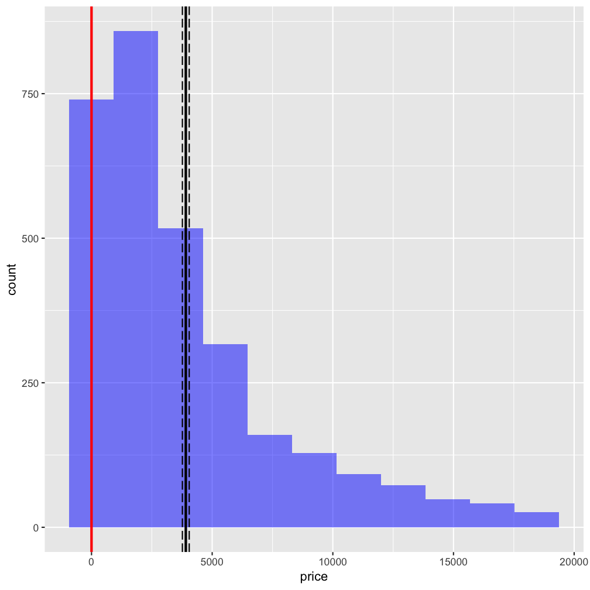

You can also call functions for visualization (see below) and access help from the console using `?visualize`


```r
visualize(
  diamonds, 
  xvar = "carat", 
  yvar = "price", 
  type = "scatter", 
  facet_row = "clarity", 
  color = "clarity", 
  custom = TRUE
) +
labs(title = "Diamond Prices ($)")
```

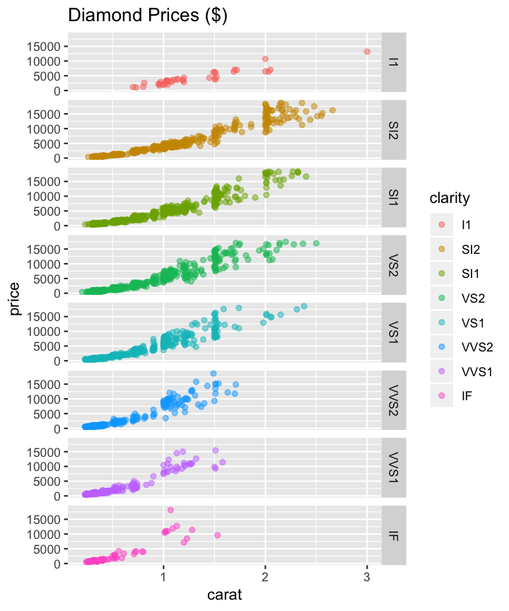

As an example, you can render the [`single_mean.Rmd`](https://radiant-rstats.github.io/docs/examples/single_mean.Rmd) file into html (or PDF or Word if you prefer) in Rstudio. Try the code in [`radiant_rcode.R`](https://radiant-rstats.github.io/docs/examples/radiant_rcode.R) for a more extensive example.

To install Radiant with complete documentation for offline access, open R(studio) and copy-and-paste the commands below:

```r
install.packages("radiant", repos = "https://radiant-rstats.github.io/minicran/")
library(radiant)
```

This will install and load the library and the required packages. To see the index of functions currently available in, for example, Radiant's Model menu use the `help(package = "radiant.model")` command

Lets start by comparing the mean of a variable to a (population) value using R's built-in `mtcars` dataset. This functionality is in the Radiant menu _Basics > Means > Single mean_. The analysis is conducted in function `single_mean`. Calling the `summary` method on the result object will show tabular output. Calling `plot` on the same result object will produce relevant plots.


```r
result <- single_mean(
  mtcars, 
  var = "mpg", 
  comp_value = 20, 
  alternative = "greater"
)
summary(result)
```

```
Single mean test
Data      : mtcars 
Variable  : mpg 
Confidence: 0.95 
Null hyp. : the mean of mpg = 20 
Alt. hyp. : the mean of mpg is > 20 

   mean    sd n_obs n_missing
 20.091 6.027    32         0

  diff    se t.value p.value df     5% 100%  
 0.091 1.065   0.085   0.466 31 18.284  Inf  

Signif. codes:  0 '***' 0.001 '**' 0.01 '*' 0.05 '.' 0.1 ' ' 1
```

```r
plot(result, plots = c("hist", "simulate"))
```

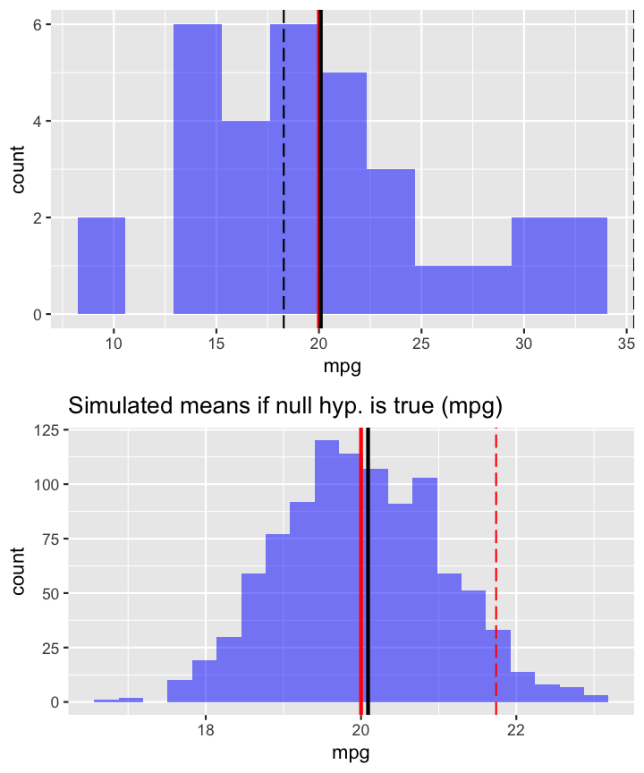

To compare the mean price of diamonds across different levels of clarity we can call the `compare_means` function:


```r
result <- compare_means(
  diamonds, 
  var1 = "clarity", 
  var2 = "price", 
  adjust = "bonf"
)
summary(result)
```

```
Pairwise mean comparisons (t-test)
Data      : diamonds 
Variables : clarity, price 
Samples   : independent 
Confidence: 0.95 
Adjustment: Bonferroni 

 clarity      mean   n        sd      se      me
      I1 4,194.775  40 2,519.678 398.396 805.832
     SI2 5,100.189 529 4,406.982 191.608 376.407
     SI1 3,998.577 721 3,813.190 142.011 278.804
     VS2 3,822.967 661 3,917.484 152.372 299.193
     VS1 3,789.181 442 3,880.907 184.596 362.797
    VVS2 3,337.820 284 3,932.706 233.363 459.348
    VVS1 2,608.460 224 3,201.282 213.895 421.513
      IF 2,411.697  99 3,330.560 334.734 664.268

 Null hyp.     Alt. hyp.                diff     p.value    
 I1 = SI2      I1 not equal to SI2      -905.414 1          
 I1 = SI1      I1 not equal to SI1       196.198 1          
 I1 = VS2      I1 not equal to VS2       371.808 1          
 I1 = VS1      I1 not equal to VS1       405.594 1          
 I1 = VVS2     I1 not equal to VVS2      856.955 1          
 I1 = VVS1     I1 not equal to VVS1     1586.315 0.023   *  
 I1 = IF       I1 not equal to IF       1783.078 0.025   *  
 SI2 = SI1     SI2 not equal to SI1     1101.612 < .001  ***
 SI2 = VS2     SI2 not equal to VS2     1277.222 < .001  ***
 SI2 = VS1     SI2 not equal to VS1     1311.008 < .001  ***
 SI2 = VVS2    SI2 not equal to VVS2    1762.369 < .001  ***
 SI2 = VVS1    SI2 not equal to VVS1    2491.729 < .001  ***
 SI2 = IF      SI2 not equal to IF      2688.492 < .001  ***
 SI1 = VS2     SI1 not equal to VS2      175.610 1          
 SI1 = VS1     SI1 not equal to VS1      209.396 1          
 SI1 = VVS2    SI1 not equal to VVS2     660.757 0.446      
 SI1 = VVS1    SI1 not equal to VVS1    1390.117 < .001  ***
 SI1 = IF      SI1 not equal to IF      1586.880 0.001   ***
 VS2 = VS1     VS2 not equal to VS1       33.786 1          
 VS2 = VVS2    VS2 not equal to VVS2     485.146 1          
 VS2 = VVS1    VS2 not equal to VVS1    1214.507 < .001  ***
 VS2 = IF      VS2 not equal to IF      1411.270 0.005   ** 
 VS1 = VVS2    VS1 not equal to VVS2     451.361 1          
 VS1 = VVS1    VS1 not equal to VVS1    1180.721 0.001   ***
 VS1 = IF      VS1 not equal to IF      1377.484 0.012   *  
 VVS2 = VVS1   VVS2 not equal to VVS1    729.361 0.606      
 VVS2 = IF     VVS2 not equal to IF      926.123 0.68       
 VVS1 = IF     VVS1 not equal to IF      196.763 1          

Signif. codes:  0 '***' 0.001 '**' 0.01 '*' 0.05 '.' 0.1 ' ' 1
```

```r
plot(result, plots = c("bar", "density"))
```

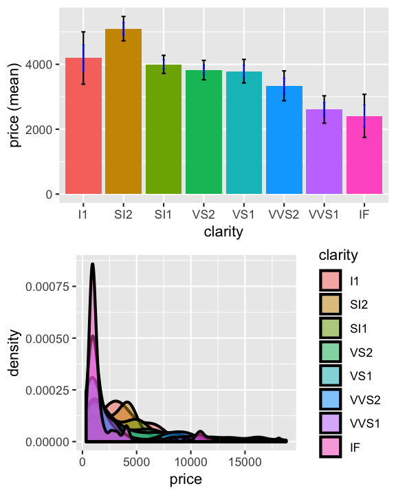
  
To get help for the `single_mean` and `compare_means` functions use `?single_mean` and `?compare_means`. These help files also have links to information about the `summary` and `plot` methods for each class. See also `?summary.single_mean` and `?plot.compare_means`
 
These datasets are available after loading the radiant library by using the `data` function. We can also load data through Radiant's browser interface and then access the data from the console after closing the app. Start radiant using the command below and then click select `Examples` from the `Load data of type` dropdown in the _Data > Manage_ tab. Then close the app by clicking the <i title='Power off' class='fa fa-power-off'></i> icon in the navbar and then clicking `Stop`. The datasets loaded through the web-interface are now available in the `r_data` environment as well. To use them directly in your code use `attach(r_data)`.


```r
## start radiant in Rstudio, load the example data, then click the power icon and Stop
radiant::radiant()
```

Because we already loaded the radiant library we already have access to all the data we need here. Lets use the `compare_means` function to evaluate salary data for professors of different ranks using:


```r
result <- compare_means(salary, var1 = "rank", var2 = "salary")
summary(result)
```

```
Pairwise mean comparisons (t-test)
Data      : salary 
Variables : rank, salary 
Samples   : independent 
Confidence: 0.95 
Adjustment: None 

      rank        mean   n         sd        se        me
  AsstProf  80,775.985  67  8,174.113   998.627 1,993.823
 AssocProf  93,876.438  64 13,831.700 1,728.962 3,455.056
      Prof 126,772.109 266 27,718.675 1,699.541 3,346.322

 Null hyp.              Alt. hyp.                         diff      p.value    
 AsstProf = AssocProf   AsstProf not equal to AssocProf   -13100.45 < .001  ***
 AsstProf = Prof        AsstProf not equal to Prof        -45996.12 < .001  ***
 AssocProf = Prof       AssocProf not equal to Prof       -32895.67 < .001  ***

Signif. codes:  0 '***' 0.001 '**' 0.01 '*' 0.05 '.' 0.1 ' ' 1
```

```r
plot(result)
```

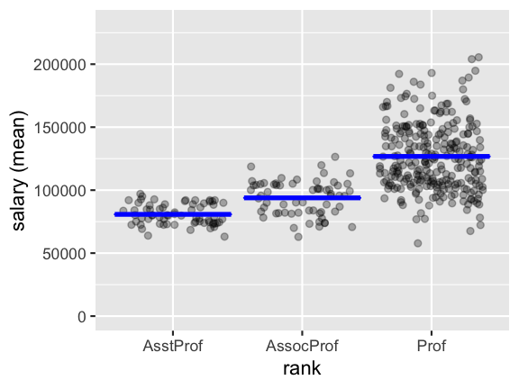

An alternative way to write this code is to use `piping` (see [dplyr](https://cran.r-project.org/web/packages/dplyr/vignettes/introduction.html) and [magrittr](https://cran.r-project.org/web/packages/magrittr/vignettes/magrittr.html) vignettes):


```r
salary %>% 
  compare_means("rank", "salary") %>% 
  {summary(.); plot(.)}
```

```
Pairwise mean comparisons (t-test)
Data      : . 
Variables : rank, salary 
Samples   : independent 
Confidence: 0.95 
Adjustment: None 

      rank        mean   n         sd        se        me
  AsstProf  80,775.985  67  8,174.113   998.627 1,993.823
 AssocProf  93,876.438  64 13,831.700 1,728.962 3,455.056
      Prof 126,772.109 266 27,718.675 1,699.541 3,346.322

 Null hyp.              Alt. hyp.                         diff      p.value    
 AsstProf = AssocProf   AsstProf not equal to AssocProf   -13100.45 < .001  ***
 AsstProf = Prof        AsstProf not equal to Prof        -45996.12 < .001  ***
 AssocProf = Prof       AssocProf not equal to Prof       -32895.67 < .001  ***

Signif. codes:  0 '***' 0.001 '**' 0.01 '*' 0.05 '.' 0.1 ' ' 1
```

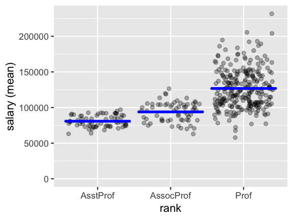

We can also run regressions and get output in a format that would require many lines of code to produce from scratch:


```r
result <- regress(diamonds, rvar = "price", evar = c("carat", "clarity"))
summary(result, sum_check = "confint")
```

```
Linear regression (OLS)
Data     : diamonds 
Response variable    : price 
Explanatory variables: carat, clarity 
Null hyp.: the effect of x on price is zero
Alt. hyp.: the effect of x on price is not zero

              coefficient std.error t.value p.value    
 (Intercept)    -6780.993   204.952 -33.086  < .001 ***
 carat           8438.030    51.101 165.125  < .001 ***
 clarity|SI2     2790.760   201.395  13.857  < .001 ***
 clarity|SI1     3608.531   200.508  17.997  < .001 ***
 clarity|VS2     4249.906   201.607  21.080  < .001 ***
 clarity|VS1     4461.956   204.592  21.809  < .001 ***
 clarity|VVS2    5109.476   210.207  24.307  < .001 ***
 clarity|VVS1    5027.669   214.251  23.466  < .001 ***
 clarity|IF      5265.170   233.658  22.534  < .001 ***

Signif. codes:  0 '***' 0.001 '**' 0.01 '*' 0.05 '.' 0.1 ' ' 1

R-squared: 0.904,  Adjusted R-squared: 0.904 
F-statistic: 3530.024 df(8,2991), p.value < .001
Nr obs: 3,000 

             coefficient      2.5%     97.5%     +/-
(Intercept)    -6780.993 -7182.855 -6379.131 401.862
carat           8438.030  8337.834  8538.227 100.196
clarity|SI2     2790.760  2395.873  3185.646 394.886
clarity|SI1     3608.531  3215.384  4001.679 393.148
clarity|VS2     4249.906  3854.604  4645.208 395.302
clarity|VS1     4461.956  4060.801  4863.111 401.155
clarity|VVS2    5109.476  4697.311  5521.640 412.165
clarity|VVS1    5027.669  4607.574  5447.764 420.095
clarity|IF      5265.170  4807.024  5723.317 458.147
```

```r
pred <- predict(result, pred_cmd = "carat = 1:10")
print(pred, n = 10)
```

```
Linear regression (OLS)
Data                 : diamonds 
Response variable    : price 
Explanatory variables: carat, clarity 
Interval             : confidence 
Prediction command   : carat = 1:10 

 clarity carat Prediction      2.5%     97.5%     +/-
     SI1     1   5265.569  5174.776  5356.362  90.793
     SI1     2  13703.599 13557.662 13849.536 145.937
     SI1     3  22141.629 21908.326 22374.933 233.303
     SI1     4  30579.660 30251.571 30907.748 328.088
     SI1     5  39017.690 38592.329 39443.051 425.361
     SI1     6  47455.720 46931.983 47979.458 523.738
     SI1     7  55893.751 55271.056 56516.445 622.695
     SI1     8  64331.781 63609.787 65053.775 721.994
     SI1     9  72769.811 71948.301 73591.322 821.511
     SI1    10  81207.842 80286.667 82129.017 921.175
```


```r
plot(result, plots = "coef")
```

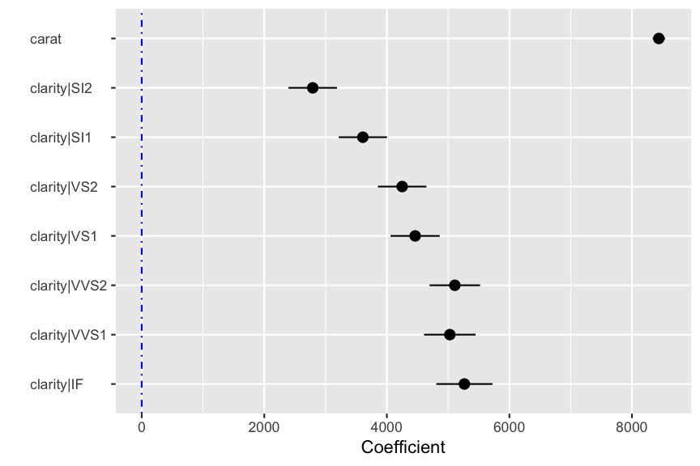


```r
plot(result, plots = "dashboard", lines = "line")
```

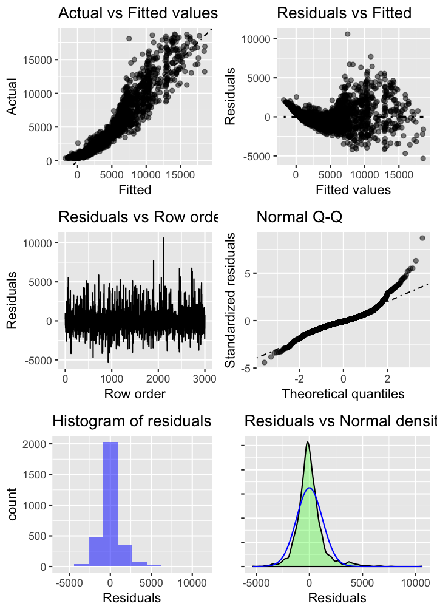

As another example, imagine that you want to segment a sample of respondents based on their toothpaste attitudes. Below is the required code to produce results using functions from the Radiant package. For help on the commands and options for cluster analysis use `?hclus`, `?plot.hclus`, and `?klus`. See also the Radiant function manuals linked above.


```r
## run hierarchical cluster analysis on the shopping data, variables v1 through v6
result <- hclus(shopping, "v1:v6")

## summary - not much here - plots are more important
summary(result)
```

```
Hierarchical cluster analysis
Data        : shopping 
Variables   : v1, v2, v3, v4, v5, v6 
Method      : ward.D 
Distance    : sq.euclidian 
Observations: 20 
```

```r
## check the help file on how to plot results from hierarchical cluster
## analysis default plots
## it looks like there is a big jump in overall within-cluster
## heterogeneity in the step from 3 to 2 segments
plot(result)
```

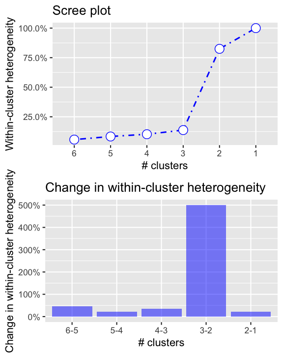


```r
## show the dendrogram with cutoff at 0.05
plot(result, plots = "dendro", cutoff = 0.05)
```

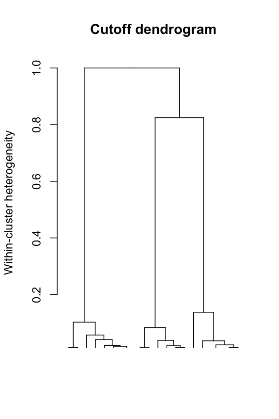


```r
## plots created above suggest 3 clusters may be  most appropriate
## use kclus to create the clusters
## generate output and store cluster membership
result <- kclus(shopping, vars = "v1:v6", nr_clus = 3)
summary(result)
```

```
K-means cluster analysis
Data         : shopping 
Variables    : v1, v2, v3, v4, v5, v6 
Clustering by: K-means
HC method    : ward.D 
HC distance  : sq.euclidian 
Observations : 20 
Generated    : 3 clusters of sizes 8 | 6 | 6 

Cluster means:
             v1   v2   v3   v4   v5   v6
 Cluster 1 5.75 3.62 6.00 3.12 1.88 3.88
 Cluster 2 1.67 3.00 1.83 3.50 5.50 3.33
 Cluster 3 3.50 5.83 3.33 6.00 3.50 6.00

Percentage of within cluster heterogeneity accounted for by each cluster:
                
Cluster 1 40.31%
Cluster 2 25.98%
Cluster 3 33.71%

Between cluster heterogeneity accounts for 73.93% of the
total heterogeneity in the data (higher is better).
```

```r
plot(result, plots = c("density","bar"))
```

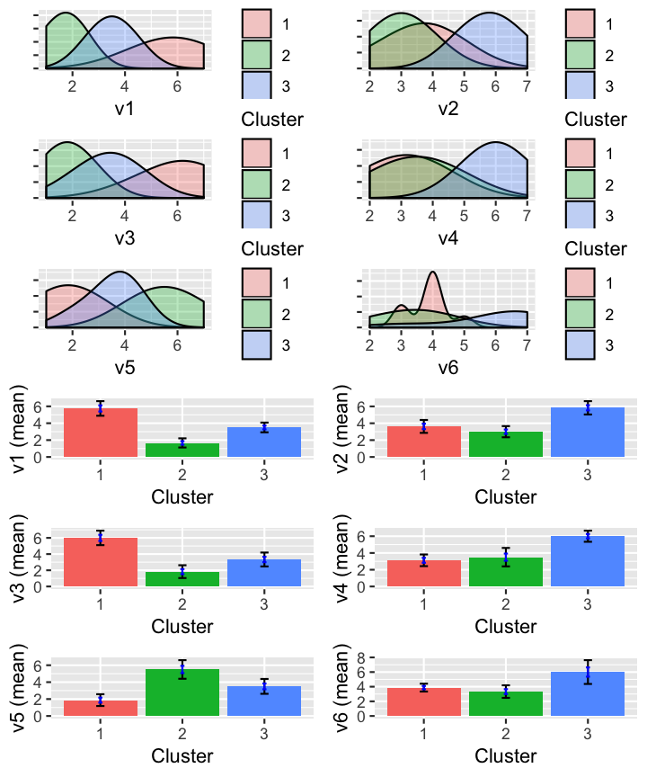

```r
shopping <- store(shopping, result, name = "clus")

## was the data really changed?
head(shopping)
```

```
# A tibble: 6 x 8
     id    v1    v2    v3    v4    v5    v6 clus 
  <int> <int> <int> <int> <int> <int> <int> <fct>
1     1     6     4     7     3     2     3 1    
2     2     2     3     1     4     5     4 2    
3     3     7     2     6     4     1     3 1    
4     4     4     6     4     5     3     6 3    
5     5     1     3     2     2     6     4 2    
6     6     6     4     6     3     3     4 1    
```

See if you can reproduce this output in the radiant web-interface. Start `Radiant` from the `Addins` dropdown in Rstudio. You can also run code inside the Radiant app in the _Report > R_ tab. See <a href="https://radiant-rstats.github.io/docs/data/code.html" target="_blank">Code</a> page for details.
